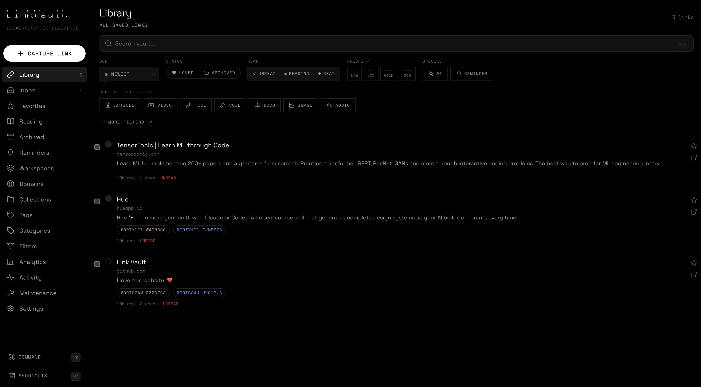

# LinkVault

> Local-first link intelligence for people who save too much and still want to find the right thing later.

LinkVault is a private, offline-capable web application for capturing, organizing, enriching, rediscovering, and exporting web links. It stores everything on your device — no accounts, no cloud databases, no tracking. AI features are entirely optional and run through your own OpenAI-compatible provider (such as VoidAI).



## Why LinkVault?

Most bookmarking tools eventually become a graveyard of forgotten links. LinkVault is designed around a different question: **How do you keep hundreds or thousands of saved links usable over time?**

The answer is a system built for **capture, retrieval, cleanup, resurfacing, and long-term usefulness** — not just storage.

## Core Philosophy

- **Private by default** — Your data lives in your browser. Nothing leaves your device unless you explicitly export it or invoke an optional AI feature.
- **Offline-first** — Core workflows work without an internet connection. Metadata fetching and AI are the only online features, and both are optional.
- **Open and portable** — Your vault is a JSON file you own. Import, export, backup, and restore are first-class features.
- **AI-augmented, not AI-dependent** — Every AI feature is a toggle. The app is fully functional with AI completely disabled.

## Features

### Link Capture
- Add links manually with full metadata editing
- Auto-normalize URLs and strip tracking parameters
- Fetch page title, description, favicon, and preview image
- Extract multiple links from pasted text
- Duplicate detection with the option to keep both
- Quick-add mode for rapid inboxing
- Draft links before final confirmation

### Link Library
- Browse all saved links in a clean, searchable list
- Edit any link's title, description, notes, tags, category, and collections
- Delete individual links or bulk delete selections
- Duplicate links into other collections
- Archive links without deleting
- Restore archived links
- Favorite / pin important links
- Track created, updated, last-opened, and open-count timestamps
- Copy original or normalized URL to clipboard
- Open links directly in your browser

### Organization
- **Categories** — One category per link for high-level grouping
- **Tags** — Multiple tags per link for cross-cutting concerns
- **Collections** — Manual folders for project-based grouping
- **Workspaces** — Group links by initiative or context
- **Read status** — Mark links as unread, reading, or read
- **Priority** — low, medium, high, urgent
- **Personal notes** — Long-form annotations on every link
- **Domain profiles** — Auto-apply default tags and categories per domain

### Search, Filters & Discovery
- Full-text search across URLs, titles, descriptions, notes, tags, and categories
- Filter by category, tag, collection, workspace, domain, read status, priority, AI-enriched status, date range, and more
- Combine multiple filters at once
- Sort by newest, oldest, updated, alphabetical, most opened, last opened, domain, priority, and confidence
- Save reusable filter presets (coming soon)
- Surface links with missing metadata
- Show duplicate or near-duplicate links
- Show orphan tags and empty categories
- Resurface candidates that haven't been opened in a long time

### Inbox & Reading Workflows
- **Inbox** — Uncategorized links waiting to be triaged
- **Favorites** — Pinned links you reference often
- **Reading List** — Links actively being read
- **Archived** — Soft-deleted links you may want later

### Metadata Enrichment
- Fetch metadata from the target page on demand
- Bulk refresh metadata for selected links
- Resolve canonical URLs and detect redirects
- Extract Open Graph data where available
- Detect page language and content type (article, video, tool, repo, documentation, paper, etc.)
- Gracefully handle metadata fetch failures

### AI Features (Optional, via VoidAI)
All AI features are **opt-in** and require you to configure your own OpenAI-compatible API endpoint and key. No data is sent to AI unless you explicitly enable it.

- AI-powered tag suggestions from title, description, and URL
- AI-generated summaries of saved pages
- AI-suggested categories
- AI content-type classification
- AI duplicate detection based on semantic similarity
- AI-generated titles when metadata is poor
- Configurable privacy mode (strict vs relaxed)
- Per-feature toggles — enable only the AI capabilities you want

### Import, Export & Backup
- Export entire vault as JSON with optional secret inclusion
- Import JSON exports back into the vault
- Merge import mode (adds to existing data)
- Replace import mode (wipes and restores)
- Duplicate handling rules during import
- Dry-run import preview with validation
- Dated export filenames for versioned backups
- Import browser bookmark HTML files (coming soon)
- Export CSV for spreadsheet workflows (coming soon)

### Bulk Actions
- Multi-select links via checkboxes
- Bulk tag assignment and removal
- Bulk category assignment
- Bulk move to collection
- Bulk archive / unarchive
- Bulk delete
- Bulk metadata refresh
- Bulk favorite / unfavorite
- Bulk mark as read / unread
- Bulk priority changes

### Analytics & Insights
- Total links, favorites, unread, and archived counts
- Read status breakdown with segmented progress bars
- Vault quality metrics (AI enriched, never opened, broken links)
- Top tags, top domains, and category distribution
- Domain-level save and open counts
- Metadata coverage tracking

### Maintenance & Cleanup
- **Duplicate detector** — Find links with identical normalized URLs
- **Broken link checker** — Identify links marked as broken
- **Missing metadata** — Find links without titles or descriptions
- **Uncategorized links** — Find inbox items without a category
- **Untagged links** — Find active links with no tags
- **Orphan tags** — Tags with no associated links
- **Empty categories** — Categories with no links
- One-click cleanup actions for each issue type

### App Settings
- **Theme** — Dark, light, or system preference
- **Default view** — List or grid
- **Favicon display** — Show or hide site icons
- **Metadata timeout** — Configurable fetch timeout
- **Destructive confirmation** — Toggle confirmation dialogs
- **AI configuration** — Base URL, API key, model selection, auto-enrich, privacy mode, feature toggles
- **Keyboard shortcuts** — Command palette via `Cmd/Ctrl + K`

### Command Palette
- Press `Cmd/Ctrl + K` anywhere in the app
- Jump to any view instantly
- Search and open links by title or domain
- Fast navigation without reaching for the mouse

## Tech Stack

| Layer | Technology |
|-------|------------|
| Framework | [Next.js](https://nextjs.org/) 16 (App Router) |
| Language | TypeScript |
| Styling | [Tailwind CSS](https://tailwindcss.com/) v4 |
| Fonts | Doto (display), Space Grotesk (body), Space Mono (data/labels) |
| Linting | [Biome](https://biomejs.dev/) |
| Icons | Custom monoline SVG set (Lucide-inspired) |
| State | React hooks with localStorage persistence |
| AI | OpenAI-compatible API (VoidAI, OpenAI, etc.) |

## Design System

LinkVault uses a custom design system inspired by Nothing's industrial aesthetic:

- **Monochrome palette** — OLED black backgrounds, precise gray scale hierarchy
- **Typography-driven hierarchy** — Space Grotesk and Space Mono for Swiss precision
- **Dot-matrix motif** — Decorative grid patterns for visual texture
- **Segmented progress bars** — Mechanical, instrument-like data visualization
- **No shadows, no gradients, no blur** — Flat surfaces, border separation
- **Asymmetric composition** — Deliberately unbalanced layouts with confident negative space

## Getting Started

### Prerequisites
- Node.js 20+
- npm or equivalent package manager

### Installation

```bash
# Clone the repository
git clone https://github.com/yourusername/LinkVault.git
cd LinkVault

# Install dependencies
npm install

# Run the development server
npm run dev
```

Open [http://localhost:3000](http://localhost:3000) in your browser.

### Build for Production

```bash
npm run build
```

The static export is generated in the `out/` directory.

### Lint and Format

```bash
npm run lint
npm run lint:fix
npm run format
```

## Configuration

### Environment Variables

Create a `.env.local` file (or use `.env.example` as a template):

```bash
# Optional: AI configuration via VoidAI or any OpenAI-compatible provider
VOIDAI_BASE_URL=https://api.openai.com/v1
VOIDAI_API_KEY=your-api-key-here
VOIDAI_MODEL=gpt-4o-mini
VOIDAI_AUTO_ENRICH=false
```

**Note:** AI features are completely optional. The app works 100% offline without any API key.

### AI Setup

1. Go to **Settings > AI Configuration**
2. Enable AI
3. Enter your base URL (e.g., `https://api.openai.com/v1`)
4. Enter your API key
5. Choose a model (e.g., `gpt-4o-mini`)
6. Toggle individual AI features on/off
7. Set privacy mode to **strict** (review what's sent) or **relaxed** (auto-send)

## Data Model

LinkVault persists all data to `localStorage` under the key `linkvault_v2`. The schema is versioned for future migrations.

### Core Entities

- **Link** — URL, metadata, tags, category, collections, notes, read status, priority, reminders, health, open count
- **Category** — Named group, one per link
- **Tag** — Named label, many per link
- **Collection** — Manual folder, many per link
- **Workspace** — Project-level grouping
- **Saved Filter** — Reusable search + filter + sort combination
- **Domain Profile** — Per-domain defaults and notes
- **Activity Log** — Audit trail of changes
- **Settings** — App preferences and AI configuration

### Portability

Your entire vault is a single JSON object. Export it anytime from **Settings > Export JSON**. The export excludes your AI API key by default for security.

## Architecture

```
app/
├── components/          # UI components (Nothing design system)
├── hooks/             # React hooks (vault state, view state)
├── lib/
│   ├── types.ts       # TypeScript definitions
│   ├── db.ts          # localStorage persistence layer
│   ├── utils.ts       # URL parsing, formatting, helpers
│   ├── metadata.ts    # Page metadata fetching
│   └── ai.ts          # VoidAI integration
├── page.tsx           # Main app shell
├── layout.tsx         # Root layout with fonts
└── globals.css        # Design tokens and Tailwind theme
```

### Key Decisions

- **No server-side rendering for data** — Everything is client-side to guarantee privacy and offline capability
- **Debounced saves** — localStorage writes are batched with a 300ms debounce to avoid performance issues
- **Immutable updates** — All state changes create new objects for predictable React rendering
- **Graceful degradation** — AI and metadata fetching fail silently without blocking core workflows
- **Schema versioning** — Local data includes a version number for automatic migrations

## Privacy & Security

- **No cloud database** — Nothing is stored on remote servers
- **No analytics or tracking** — No telemetry, cookies, or external scripts
- **AI data control** — Only text you explicitly choose to enrich is sent to your AI provider. API keys are stored in `localStorage` and never exported.
- **Strict privacy mode** — Shows you exactly what will be sent to the AI before each request
- **Export excludes secrets** — Your API key is stripped from exports by default

## Roadmap

### Completed
- [x] Local-first data model with schema versioning
- [x] Link capture with metadata fetching
- [x] Full-text search and advanced filtering
- [x] Tags, categories, and collections
- [x] Favorites, archive, and read status
- [x] Bulk actions
- [x] Import / export JSON
- [x] Analytics dashboard
- [x] Maintenance and cleanup center
- [x] Command palette (`Cmd/Ctrl + K`)
- [x] Dark / light theme
- [x] Optional AI enrichment (tag suggestions, summaries, categorization)
- [x] Domain intelligence view

### Upcoming
- [ ] Browser bookmark HTML import/export
- [ ] CSV import/export
- [ ] Saved filter presets and smart collections
- [ ] Reminder and revisit system
- [ ] Broken-link checker with automatic health updates
- [ ] Rule-based auto-tagging and auto-categorization
- [ ] Link relations and backlinking
- [ ] Session notes for research bursts
- [ ] Keyboard shortcut customization
- [ ] PWA support for offline installation

## Contributing

Contributions are welcome. Please open an issue to discuss significant changes before submitting a pull request.

## License

MIT — See [LICENSE](./LICENSE) for details.

---

**Built with precision. Designed for permanence.**
